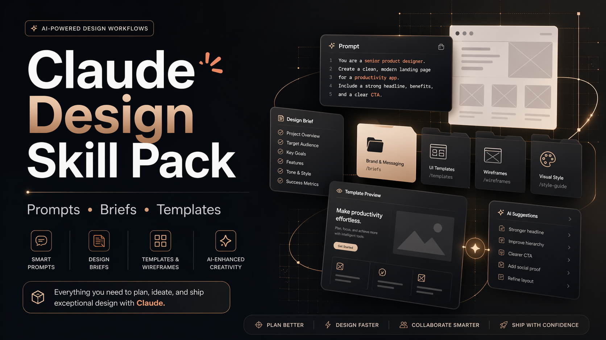

# Claude Design Skill Pack

[Turkce](#turkce) | [English](#english)

  

## Turkce

Claude Design'dan daha iyi sonuc almak icin hazirlanmis 7 tekrar kullanilabilir prompt-skill paketi.

Bu repo, Claude Design'i genel bir chatbot gibi degil; daha odakli bir tasarim ve urun ortagi gibi kullanmak isteyen icerik ureticileri, kurucular, pazarlamacilar ve urun ekipleri icin hazirlandi.

## Bu repo neden var

Cogu kisi Claude Design'i belirsiz promptlarla kullaniyor ve ortalama sonuc aliyor.

Bu 7 skill bunu duzeltmek icin sana sunlari verir:

- net bir kullanim senaryosu
- yapilandirilmis bir girdi listesi
- kopyala-yapistir prompt
- daha iyi tanimli bir cikti formati

## 7 skill

1. [Brief Architect](skills/01-brief-architect.md)
   Kaba bir fikri, build-ready bir urun veya tasarim brief'ine donusturur.
2. [Screenshot Rebuilder](skills/02-screenshot-rebuilder.md)
   Bir ekran goruntusu veya referans sayfayi, kendi urunun icin yapilandirilmis bir UI yonune cevirir.
3. [Homepage Converter](skills/03-homepage-converter.md)
   Hero copy, bolum sirasi, CTA stratejisi ve donusum netligini iyilestirir.
4. [Design System Refactorer](skills/04-design-system-refactorer.md)
   Daginik tasarimlardan token, component, spacing ve tekrar kullanilabilir desenler cikarir.
5. [UX Critic](skills/05-ux-critic.md)
   Gercek kullanicilar yasamadan once surtunme, belirsizlik ve zayif akislari bulur.
6. [One-Shot Builder](skills/06-one-shot-builder.md)
   Claude Design'dan daha guclu bir ilk taslak almani saglar.
7. [Launch Content Pack](skills/07-launch-content-pack.md)
   Bitmis bir tasarimi sosyal paylasim, demo script, changelog ve lansman metnine cevirir.

## En iyi kullanim sekli

1. Ihtiyacina gore bir skill sec.
2. Placeholder alanlarini urunun, hedef kitlen ve hedeflerinle doldur.
3. Promptu Claude Design'a yapistir.
4. Sonucu incele.
5. Gerekirse daha net kisitlarla ikinci tur calistir.

## Onerilen akis

Bir projede bu skill'leri su sirayla kullan:

1. `Brief Architect`
2. `Screenshot Rebuilder`
3. `One-Shot Builder`
4. `Homepage Converter`
5. `Design System Refactorer`
6. `UX Critic`
7. `Launch Content Pack`

## Claude Design'i daha iyi kullandiran prompting kurallari

- Istemeden once baglam ver.
- Hedef kitleyi, amaci ve kisitlari acik yaz.
- Sadece "daha iyi yap" deme; yapi iste.
- Tradeoff zorla: sade mi premium mu, hizli mi detayli mi, oyuncu mu guvenilir mi.
- Neyi onceliklendirmesi ve nelerden kacinmasi gerektigini yaz.

## Kimler icin

- startup kuruculari
- indie hacker'lar
- pazarlamacilar
- urun tasarimcilari
- no-code builder'lar
- Claude Design hakkinda video veya icerik uretecek kisiler

## Lisans

MIT

## English

Seven reusable prompt-skills for getting better output from Claude Design faster.

This repository is built for creators, founders, marketers, and product teams who want Claude Design to behave less like a generic chatbot and more like a focused design partner.

## Why this repo exists

Most people use Claude Design with vague prompts and get average results.

These seven skills solve that problem by giving you:

- a clear use case
- a structured input checklist
- a copy-paste prompt
- a better output shape

## The 7 skills

1. [Brief Architect](skills/01-brief-architect.md)
   Turn a rough idea into a build-ready product or design brief.
2. [Screenshot Rebuilder](skills/02-screenshot-rebuilder.md)
   Convert inspiration from a screenshot or existing page into a structured UI direction.
3. [Homepage Converter](skills/03-homepage-converter.md)
   Improve hero copy, section order, CTA strategy, and conversion clarity.
4. [Design System Refactorer](skills/04-design-system-refactorer.md)
   Extract tokens, components, spacing, and reusable patterns from messy designs.
5. [UX Critic](skills/05-ux-critic.md)
   Find friction, confusion, and weak flows before your users do.
6. [One-Shot Builder](skills/06-one-shot-builder.md)
   Ask Claude Design to generate a stronger first version with less back-and-forth.
7. [Launch Content Pack](skills/07-launch-content-pack.md)
   Turn a finished design into social posts, demo scripts, changelogs, and launch copy.

## Best way to use this pack

1. Pick one skill based on the job to be done.
2. Fill the placeholders with your product, audience, and goals.
3. Paste the prompt into Claude Design.
4. Review the result.
5. Run a second pass with tighter constraints if needed.

## Recommended workflow

Use the skills in this order for a full project:

1. `Brief Architect`
2. `Screenshot Rebuilder`
3. `One-Shot Builder`
4. `Homepage Converter`
5. `Design System Refactorer`
6. `UX Critic`
7. `Launch Content Pack`

## Prompting rules that make Claude Design better

- Give context before asking for output.
- Name the audience, goal, and constraints explicitly.
- Ask for structure, not just "make it better".
- Force tradeoffs: simple vs premium, fast vs detailed, playful vs credible.
- Tell Claude what to prioritize and what to avoid.

## Who this is for

- startup founders
- indie hackers
- marketers
- product designers
- no-code builders
- creators making tutorials or videos about Claude Design

## License

MIT
